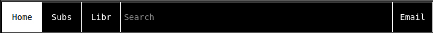

# LowTube

- LowTube is meant to simplify youtube for the purpose of better performance, lower data usage, and to fix some minor UI problems. It isn't meant to give all the features of youtube or to look nice.
- The future of LowTube is meant to be the front end for any video streaming service. This would include Odysee, Netflix, Twitch, etc. 
- Index:
	- [Logo](#logo)
	- [Heading](#heading)
	- [Video List](#video-list)
	- [Channel](#channel)
	- [Lib](#lib)
	- [Videos](#videos)
	- [Popups](#popups)
	- [Keyboard shortcuts](#keyboard-shortcuts)

## Logo

## Heading

## Video List
- There are different types of videos for the pages of Home, Subs, Search, History, and playlists.

## Channel

## Lib

## Videos

## Popups

## Keyboard shortcuts
| Keys				| Descriptions 					|
|:-:				|:-:							|
|space				|pause/play						|
|up/down arrows		|volume up/down					|
|s					|slow down video				|
|d					|speed up video					|
|left/right arrows	|move 5 sec forward/backwards	|
|f					|toggle fullscreen on and off	|